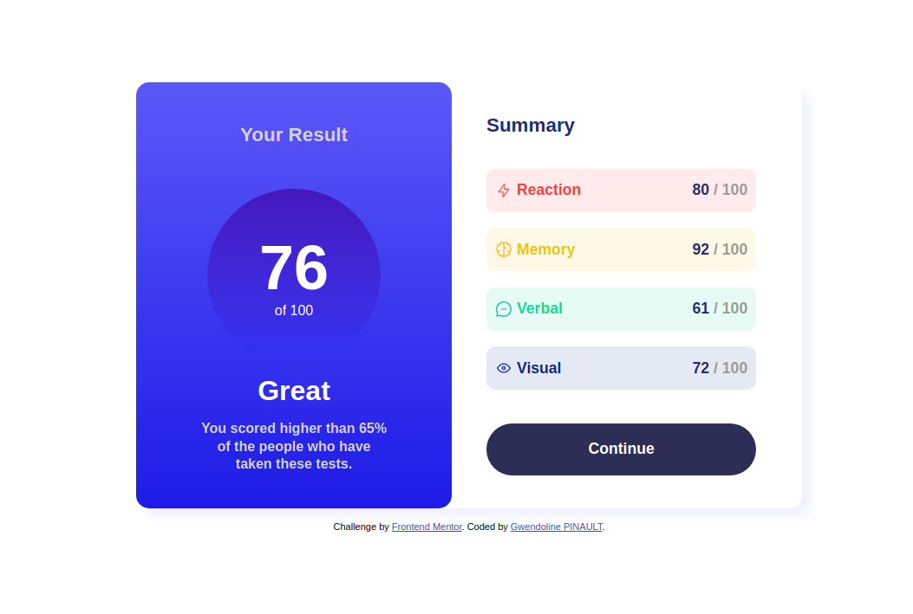
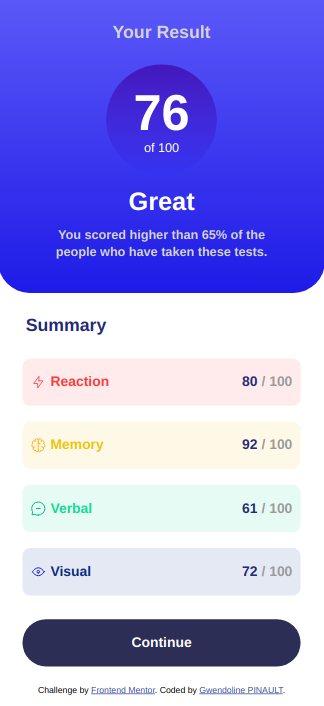

# Frontend Mentor Challenge - Results summary component

This is my solution to the [Results summary component challenge on Frontend Mentor](https://www.frontendmentor.io/challenges/results-summary-component-CE_K6s0maV). I dit it to check my coding skills.

## Table of contents
- [Frontend Mentor Challenge - Results summary component](#frontend-mentor-challenge---results-summary-component)
  - [Table of contents](#table-of-contents)
  - [Overview](#overview)
    - [The challenge](#the-challenge)
    - [Screenshot](#screenshot)
      - [Desktop design](#desktop-design)
      - [Mobile design](#mobile-design)
  - [My process](#my-process)
    - [Built with](#built-with)
    - [Why I did this challenge](#why-i-did-this-challenge)
  - [Author](#author)

## Overview

### The challenge

Users should be able to see the interface on desktop or mobile screen.

### Screenshot

#### Desktop design

#### Mobile design

## My process

### Built with

- Semantic HTML5 markup
- CSS custom properties
- Flexbox
- Media queries

### Why I did this challenge

I'm doing a development formation to become a web developer. I wanted to check my new knowledge by doing this challenge.

I did most of the challenge fiew months ago, just after my courses. I finished it today by adding the media queries. A first, it wasn't so easy, but now I've improved my CSS skills ans flexboxes doesn't seems so complicated anymore.

Now, it's your turn to challenge you, good luck !

## Author

- GitHub - [@Gwendoline-Pinault](https://github.com/Gwendoline-Pinault/results-summary-component-main)
- Seeing the project - [result-summary](https://gwendoline-pinault.github.io/results-summary-component-main/)